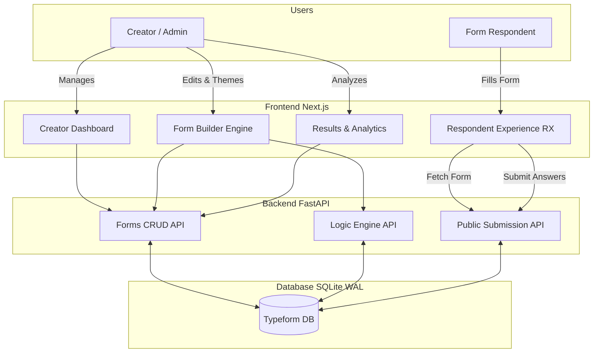

# Typeform Clone Architecture & Documentation

**Live Demo:** [https://typeform-clone-ebon.vercel.app](https://typeform-clone-ebon.vercel.app)

A production-ready, full-stack clone of the Typeform form builder and respondent experience. This project faithfully recreates Typeform's signature one-question-at-a-time conversational interface, paired with a robust creator dashboard for form construction, theming, and logic branching.

## Tech Stack

**Frontend (Creator & Respondent Experience)**
*   **Framework:** Next.js 14+ (App Router)
*   **Language:** TypeScript
*   **Styling:** Tailwind CSS, DM Sans globally
*   **Components:** shadcn/ui (Dashboard & App Shell)
*   **Interactions:** `@dnd-kit` (drag-and-drop reordering), `lucide-react` (icons)

**Backend (API & Persistence)**
*   **Framework:** FastAPI
*   **Language:** Python 3.10+
*   **Database:** SQLite 3 (configured with `WAL` journal mode for high concurrency)
*   **Validation:** Pydantic models
*   **ORM/Querying:** Standard `sqlite3` driver with parameterized queries

---

## Architectural Flow

The application is split into two completely isolated user experiences that interact with a unified backend API.



### 1. The Creator Experience (CX)
The Creator UI (`/` dashboard and `/forms/[id]/edit`) utilizes shadcn/ui and Tailwind to create a stark, minimalist SaaS environment. 
*   **State Management:** The builder uses a 3-pane architecture. The left pane lists questions (with `dnd-kit` for reordering), the center pane handles deep editing, and the right pane mounts the *exact* Respondent Experience component to provide a 1:1 live preview.
*   **Sync:** Form data is synchronized back to the FastAPI backend using debounced REST API calls to prevent flooding during typing.

### 2. The Respondent Experience (RX)
The Respondent UI (`/f/[slug]`) operates entirely independently from the dashboard.
*   **Client-Side Orchestrator:** The server loads the published form structure, and a client-side orchestrator takes over. It manages the current question index, handles keyboard navigation (Enter to submit, A/B/C for choices), and animates transitions.
*   **Logic Engine:** Logic jumps are evaluated on the client as the user progresses to instantly skip questions without server roundtrips.
*   **Theming System:** Forms inject custom CSS variables (`--rx-question`, `--rx-answer`, `--rx-radius`) globally into the RX wrapper, allowing creators to fundamentally change the geometry and palette of the form without modifying Tailwind classes.

---

## Data Model

The backend relies on 6 core relational tables designed to support partial submissions and complex branching:

1.  **`creator`**: System ownership (seeded by default).
2.  **`form`**: Holds title, publish status, unique public slug, and JSON-based theme settings.
3.  **`question`**: Belongs to a form. Has an `order_index`, a `type` (email, choice, rating, etc.), and JSON settings (like rating scales).
4.  **`logic_rule`**: Belongs to a question. Defines a `condition_value` and a `target_question_id`.
5.  **`response`**: Belongs to a form. Records `started_at` and `completed_at` to support abandonment analytics.
6.  **`answer`**: Belongs to a response and a question. Stores the raw text/value of the submission.

---

## Directory Structure

```text
typeform-clone/
├── backend/
│   ├── main.py              # FastAPI application & route definitions
│   ├── database.py          # SQLite connection and WAL configuration
│   ├── models.py            # Pydantic schemas for request/response validation
│   ├── schema.sql           # Initial database DDL
│   └── seed.py              # Script to generate sample forms and logic
├── frontend/
│   ├── src/app/             # Next.js App Router (pages & layouts)
│   ├── src/components/      # React components (Builder, Results, RX, UI)
│   ├── src/lib/             # API client, types, and theme utilities
│   ├── tailwind.config.ts   # Tailwind configuration
│   └── next.config.ts       # Next.js build configuration
├── docs/                    # Deep-dive specs (schema, api-contract)
└── AGENTS.md                # Canonical decision log for architectural history
```

---

### Deployment Note regarding SQLite
This application is deployed using a free-tier Render web service for the FastAPI backend. Because free instances use ephemeral filesystems, the SQLite database (`typeform_clone.db`) will be reset whenever Render performs a system restart. An Uptime Robot monitor is attached to prevent the 15-minute idle sleep, but data may still reset periodically. For true production persistence, a Persistent Disk must be attached to the Render instance or migrated to PostgreSQL.

---

## Local Development Setup

### Prerequisites
*   Node.js v18+
*   Python 3.10+

### 1. Start the Backend API
Navigate to the `backend` directory, create a virtual environment, and install dependencies.

```bash
cd backend
python -m venv venv

# Windows:
venv\Scripts\activate
# macOS/Linux:
source venv/bin/activate

pip install -r requirements.txt
```

Initialize the database with sample data, then start the FastAPI server:
```bash
python seed.py
uvicorn main:app --reload --port 8000
```
*The API is now running at http://localhost:8000*

### 2. Start the Frontend Application
In a new terminal window, navigate to the `frontend` directory, install dependencies, and start the Next.js development server.

```bash
cd frontend
npm install
npm run dev
```
*The web app is now running at http://localhost:3000*

---

## Environment Variables

**Frontend (`frontend/.env.local`)**
```env
# Point to your local or deployed FastAPI instance
NEXT_PUBLIC_API_URL=http://localhost:8000

# The root URL of the frontend (used to generate shareable links in the builder)
NEXT_PUBLIC_APP_URL=http://localhost:3000
```
